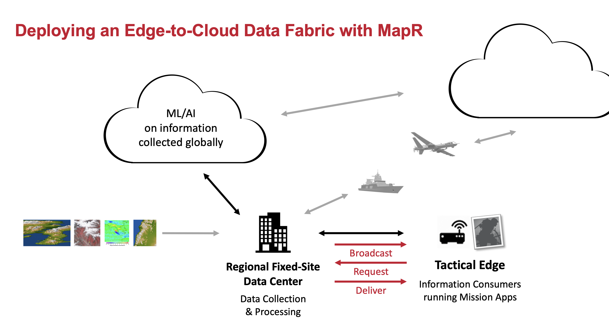
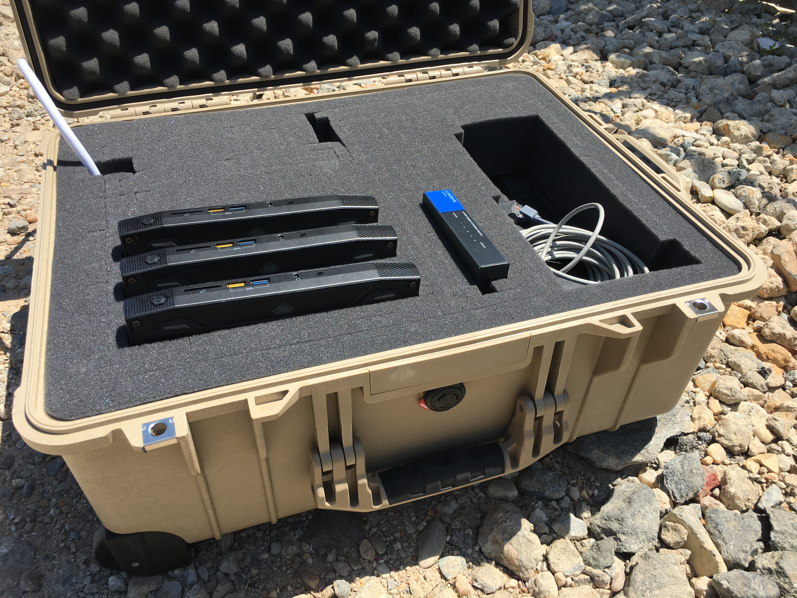

# Building a Global Data Fabric with MapR (now HPE)

This demo contains everything necessary to build an edge-to-cloud data fabric using MapR.  It comes in three variants: an **HQ** version, an **EDGE** version, and a **Cloud** version. The **HQ** version can be used standalone to demonstrate microservice architectures and data processing pipelines. The **EDGE** version only works in conjunction with the HQ version, using two clusters to demonstrate data replication. The **Cloud** version simply aggregates data from across the fabric for (for example) ML and data science initiatives.

To install the demo, run *install-demo.sh \<variant\>*.  Run the app using *runDashboard.sh \<variant\>*.  Follow the instructions to establish a connection from a web browser. See the documentation for comprehensive setup instructions.

